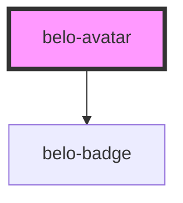

# belo-avatar

<!-- Auto Generated Below -->

## Properties

| Property       | Attribute       | Description | Type                    | Default                                                                                                                                                                         |
| -------------- | --------------- | ----------- | ----------------------- | ------------------------------------------------------------------------------------------------------------------------------------------------------------------------------- |
| `alt`          | `alt`           |             | `string`                | `"Placeholder image"`                                                                                                                                                           |
| `badge`        | `badge`         |             | `"offline" \| "online"` | `"offline"`                                                                                                                                                                     |
| `badgeCounter` | `badge-counter` |             | `number`                | `3`                                                                                                                                                                             |
| `image`        | `image`         |             | `string`                | `"https://media.licdn.com/dms/image/C4D03AQGIyU5mos4kHg/profile-displayphoto-shrink_800_800/0/1663105376656?e=1676505600&v=beta&t=oJJL8nvIcYA-f6dz7UVoNqb89VaSlUokRUqnyecIujQ"` |
| `size`         | `size`          |             | `"large" \| "small"`    | `"small"`                                                                                                                                                                       |

## Dependencies

### Depends on

- [belo-badge](../belo-badge)

### Graph

----------------------------------------------

*Built with [StencilJS](https://stenciljs.com/)*
