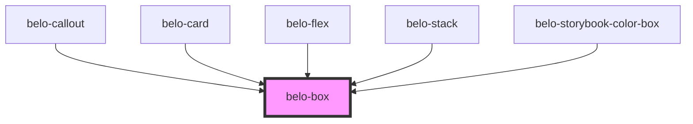

# belo-box

<!-- Auto Generated Below -->

## Properties

| Property         | Attribute         | Description | Type     | Default     |
| ---------------- | ----------------- | ----------- | -------- | ----------- |
| `alignContent`   | `align-content`   |             | `string` | `""`        |
| `alignItems`     | `align-items`     |             | `string` | `""`        |
| `bg`             | `bg`              |             | `string` | `"#FFFFFF"` |
| `borderColor`    | `border-color`    |             | `string` | `""`        |
| `borderStyle`    | `border-style`    |             | `string` | `"solid"`   |
| `borderWidth`    | `border-width`    |             | `string` | `"0"`       |
| `color`          | `color`           |             | `string` | `""`        |
| `display`        | `display`         |             | `string` | `"block"`   |
| `fd`             | `fd`              |             | `string` | `undefined` |
| `fw`             | `fw`              |             | `string` | `"nowrap"`  |
| `gap`            | `gap`             |             | `string` | `"0"`       |
| `h`              | `h`               |             | `string` | `"auto"`    |
| `justifyContent` | `justify-content` |             | `string` | `""`        |
| `m`              | `m`               |             | `string` | `"0"`       |
| `maxH`           | `max-h`           |             | `string` | `""`        |
| `maxW`           | `max-w`           |             | `string` | `""`        |
| `mb`             | `mb`              |             | `string` | `"0"`       |
| `minH`           | `min-h`           |             | `string` | `""`        |
| `minW`           | `min-w`           |             | `string` | `""`        |
| `ml`             | `ml`              |             | `string` | `"0"`       |
| `mr`             | `mr`              |             | `string` | `"0"`       |
| `mt`             | `mt`              |             | `string` | `"0"`       |
| `p`              | `p`               |             | `string` | `"0"`       |
| `pb`             | `pb`              |             | `string` | `"0"`       |
| `pl`             | `pl`              |             | `string` | `"0"`       |
| `pr`             | `pr`              |             | `string` | `"0"`       |
| `pt`             | `pt`              |             | `string` | `"0"`       |
| `rounded`        | `rounded`         |             | `string` | `"0"`       |
| `shadow`         | `shadow`          |             | `string` | `""`        |
| `w`              | `w`               |             | `string` | `"auto"`    |

## Dependencies

### Used by

 - [belo-callout](../belo-callout)
 - [belo-card](../belo-card)
 - [belo-flex](../belo-flex)
 - [belo-stack](../belo-stack)
 - [belo-storybook-color-box](../belo-storybook-color-box)

### Graph

----------------------------------------------

*Built with [StencilJS](https://stenciljs.com/)*
