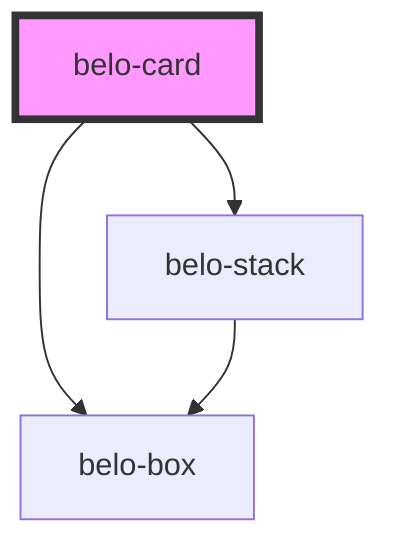

# belo-card

<!-- Auto Generated Below -->

## Properties

| Property  | Attribute | Description | Type     | Default                                                                                                                           |
| --------- | --------- | ----------- | -------- | --------------------------------------------------------------------------------------------------------------------------------- |
| `alt`     | `alt`     |             | `string` | `"Placeholder image"`                                                                                                             |
| `content` | `content` |             | `string` | `"Placeholder content"`                                                                                                           |
| `footer`  | `footer`  |             | `string` | `"Footer content"`                                                                                                                |
| `image`   | `image`   |             | `string` | `"https://media.revistaad.es/photos/62c2be405044c23fff61d3ec/master/w_1600%2Cc_limit/The%2520Boot%2520-%2520New%2520Zealand.jpg"` |
| `title`   | `title`   |             | `string` | `"Placeholder title"`                                                                                                             |

## Dependencies

### Depends on

- [belo-box](../belo-box)
- [belo-stack](../belo-stack)

### Graph

----------------------------------------------

*Built with [StencilJS](https://stenciljs.com/)*
