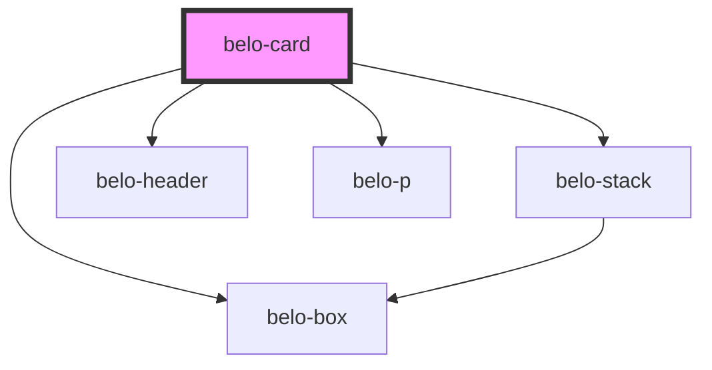

# belo-card

<!-- Auto Generated Below -->

## Properties

| Property  | Attribute | Description | Type  | Default     |
| --------- | --------- | ----------- | ----- | ----------- |
| `content` | `content` |             | `any` | `undefined` |
| `footer`  | `footer`  |             | `any` | `undefined` |
| `header`  | `header`  |             | `any` | `undefined` |
| `image`   | `image`   |             | `any` | `undefined` |

## Dependencies

### Depends on

- [belo-box](../belo-box)
- [belo-stack](../belo-stack)
- [belo-header](../belo-header)
- [belo-p](../belo-p)

### Graph

----------------------------------------------

*Built with [StencilJS](https://stenciljs.com/)*
