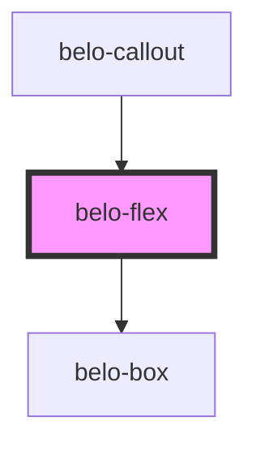

# belo-flex

<!-- Auto Generated Below -->

## Properties

| Property         | Attribute         | Description | Type                                                                                                         | Default        |
| ---------------- | ----------------- | ----------- | ------------------------------------------------------------------------------------------------------------ | -------------- |
| `alignContent`   | `align-content`   |             | `"center" \| "flex-end" \| "flex-start" \| "space-around" \| "space-between" \| "space-evenly" \| "stretch"` | `'stretch'`    |
| `alignItems`     | `align-items`     |             | `"baseline" \| "center" \| "flex-end" \| "flex-start" \| "stretch"`                                          | `'stretch'`    |
| `direction`      | `direction`       |             | `"column" \| "row"`                                                                                          | `'row'`        |
| `gap`            | `gap`             |             | `string`                                                                                                     | `"0"`          |
| `justifyContent` | `justify-content` |             | `"center" \| "flex-end" \| "flex-start" \| "space-around" \| "space-between" \| "space-evenly"`              | `'flex-start'` |
| `wrap`           | `wrap`            |             | `"nowrap" \| "wrap"`                                                                                         | `'nowrap'`     |

## Dependencies

### Used by

 - [belo-callout](../belo-callout)

### Depends on

- [belo-box](../belo-box)

### Graph

----------------------------------------------

*Built with [StencilJS](https://stenciljs.com/)*
