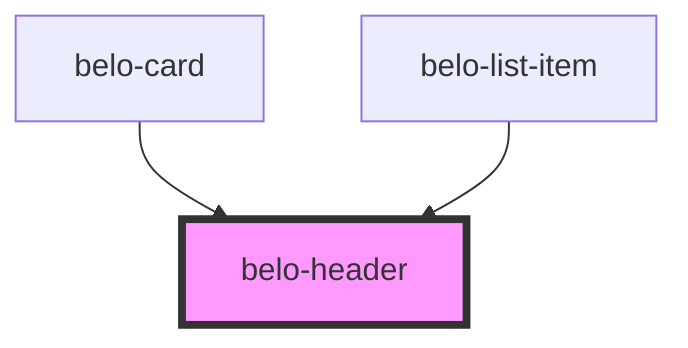

# belo-header

<!-- Auto Generated Below -->

## Properties

| Property | Attribute | Description | Type                            | Default     |
| -------- | --------- | ----------- | ------------------------------- | ----------- |
| `align`  | `align`   |             | `"center" \| "left" \| "right"` | `undefined` |
| `size`   | `size`    |             | `any`                           | `undefined` |

## Dependencies

### Used by

 - [belo-card](../belo-card)
 - [belo-list-item](../belo-list-item)

### Graph

----------------------------------------------

*Built with [StencilJS](https://stenciljs.com/)*
