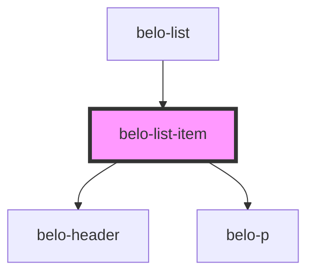

# belo-list-item

<!-- Auto Generated Below -->

## Properties

| Property      | Attribute     | Description | Type  | Default     |
| ------------- | ------------- | ----------- | ----- | ----------- |
| `description` | `description` |             | `any` | `undefined` |
| `label`       | `label`       |             | `any` | `undefined` |

## Dependencies

### Used by

 - [belo-list](../belo-list)

### Depends on

- [belo-header](../belo-header)
- [belo-p](../belo-p)

### Graph

----------------------------------------------

*Built with [StencilJS](https://stenciljs.com/)*
