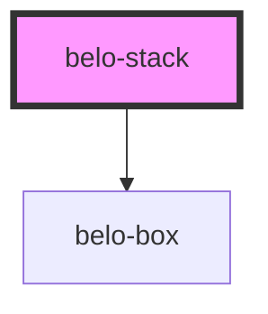

# belo-stack

<!-- Auto Generated Below -->

## Properties

| Property    | Attribute   | Description | Type                | Default    |
| ----------- | ----------- | ----------- | ------------------- | ---------- |
| `direction` | `direction` |             | `"column" \| "row"` | `'column'` |
| `gap`       | `gap`       |             | `string`            | `"0"`      |

## Dependencies

### Depends on

- [belo-box](../belo-box)

### Graph

----------------------------------------------

*Built with [StencilJS](https://stenciljs.com/)*
