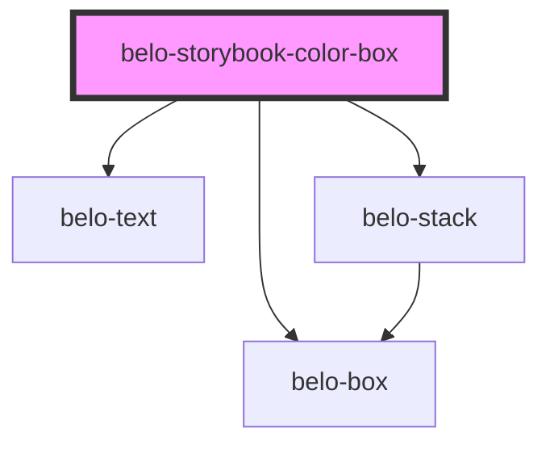

# belo-storybook-color-box

<!-- Auto Generated Below -->

## Properties

| Property        | Attribute        | Description | Type      | Default            |
| --------------- | ---------------- | ----------- | --------- | ------------------ |
| `border`        | `border`         |             | `boolean` | `false`            |
| `borderColor`   | `border-color`   |             | `string`  | `"#EBEBEB"`        |
| `boxTitle`      | `box-title`      |             | `string`  | `"AA 3.51"`        |
| `color`         | `color`          |             | `string`  | `"#FFFFFF"`        |
| `gradientColor` | `gradient-color` |             | `string`  | `""`               |
| `headingColor`  | `heading-color`  |             | `string`  | `this.targetColor` |
| `subtitle`      | `subtitle`       |             | `string`  | `"default"`        |
| `targetColor`   | `target-color`   |             | `string`  | `""`               |

## Dependencies

### Depends on

- [belo-box](../belo-box)
- [belo-text](../belo-text)
- [belo-stack](../belo-stack)

### Graph

----------------------------------------------

*Built with [StencilJS](https://stenciljs.com/)*
